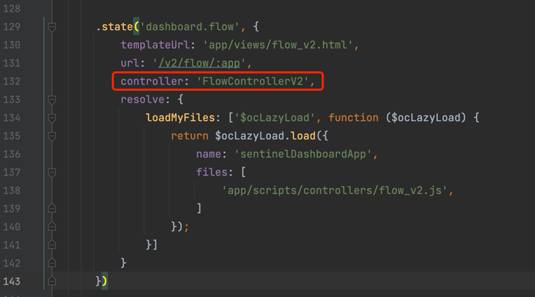

# Sentinel 规则push模式（nacos数据源）重构流程

## 0. 概述
Sentinel 是面向分布式服务架构的流量控制组件。
如果你直接从官方仓库下载使用Sentinel，通过 dashboard 配置的规则，这些规则默认是存储在内存中的，重启应用后就会消失，
换句话说，默认情况下，这些规则是不会被持久化的。试想如果在生产环境中一旦重启就丢失规则，这样的运维体验简直堪称灾难。
但 Sentinel 早已为我们有所考虑，它提供多种不同的数据源来持久化规则配置，包括file，redis、nacos、zoomkeeper等。  

网络上可以很容易地搜索到如何通过重构代码实现流控规则的持久化。  
但要知道，我们需要持久化的不仅仅只有流控规则，诸如 gateway 的 API分组、热点规则、系统规则等等也都是需要持久化的。本工程将实现 dashboard 中所有类型数据的持久化。  
这篇wiki，详细记录了我是如何通过重构 sentinel 源码，来实现 dashboard 规则持久化到 nacos 数据源中，也将针对更多其他类型数据的持久化提供解决方案。这里我使用的版本是`sentinel 1.8.2`

## 1. 下载 Sentinel 源码

首先，从官方仓库克隆代码：
```shell
git clone https://github.com/alibaba/Sentinel.git
```

## 2. 将`sentinel-dashboard`模块拆分为新的工程
为了方便源码重构，我们将项目下的`sentinel-dashboard`模块单独抽离出来一个项目，这里我将`sentinel-dashboard`重命名为`lin-sentinel-dashboard`，新项目的结构如下：
```shell
lin-sentinel-dashboard
├── pom.xml
├── src
│   ├── main
│   │   ├── java
│   │   ├── resources
│   │   └── webapp
│   └── test
│       └── java
```

需要注意的是，如果你也重命名了工程，需要修改`pom.xml`中的`artifactId`为你工程的命名。

maven 解析完成后，尝试启动工程，如果启动成功没有任何报错，则证明你的工程拆分以及maven解析都成功了。

## 3. 重构`sentinel-dashboard`源码，实现流控规则持久化到 nacos 数据源
### 3.1 修改`pom.xml`文件
打开 `pom.xml` 文件，找到`sentinel-datasource-nacos`依赖：
```xml
        <!-- for Nacos rule publisher sample -->
        <dependency>
            <groupId>com.alibaba.csp</groupId>
            <artifactId>sentinel-datasource-nacos</artifactId>
            <scope>test</scope>
        </dependency>
```
我们看到`sentinel-datasource-nacos`这个依赖的范围在`test`目录下，这是因为官方提供的`nacos`持久化示例代码都放在了test目录下。  
既然我们要重构工程，让其规则支持持久化到`nacos`配置中心，所以要注释掉`<scope>test</scope>`这一行：
```xml
        <!-- for Nacos rule publisher sample -->
        <dependency>
            <groupId>com.alibaba.csp</groupId>
            <artifactId>sentinel-datasource-nacos</artifactId>
            <!-- <scope>test</scope> -->
        </dependency>
```

### 3.2 重构前端代码
打开 resources/app/scripts/directives/sidebar/sidebar.html 文件，这个 html 对应的就是 sentinel dashboard 的侧边栏 html，找到第`56-59`行代码：
```html
          <li ui-sref-active="active" ng-if="!entry.isGateway">
            <a ui-sref="dashboard.flowV1({app: entry.app})">
                <i class="glyphicon glyphicon-filter"></i>&nbsp;&nbsp;流控规则</a>
          </li>
```
将`dashboard.flowV1({app: entry.app})`中的`flowV1`修改为`flow`：
```html
            <a ui-sref="dashboard.flow({app: entry.app})">
```

我们可以点到 `dashboard.flow()` 方法里面看下具体实现：    
   
相信你不需要深入研究源码，就可以看出，这里实际上调用的就是`FlowControllerV2`控制器的接口；而修改之前的`dashboard.flowV1()`，调用的是`FlowController`控制器的接口。

> 注意，这里修改的是**非gateway应用**的"流控规则"相关代码，如果你想要修改的是**gateway应用**的流控规则持久化，修改此处是无效的。关于gateway应用如何修改，我们后面将详细说明。

### 3.3 重构后端代码
#### 3.3.1 复制 nacos 持久化示例源码到`main`目录
在3.1步骤修改`pom.xml`的时候，我们提到 sentinel 官方早已为我们事先考虑过数据持久化的问题，并且提供了用例代码以供参考。但这些源码都放到了`test`目录下，下面我们就把这源码移动到`main`目录下。

找到`src/test/java/com/alibaba/csp/sentinel/dashboard/rule/nacos`包，看到如下几个类：
```shell
.
├── FlowRuleNacosProvider.java
├── FlowRuleNacosPublisher.java
├── NacosConfig.java
└── NacosConfigUtil.java
```

我们后续要基于这几个类进行改造，所以现在要把整个`src/test/java/com/alibaba/csp/sentinel/dashboard/rule/nacos`包，
复制到`src/main/java/com/alibaba/csp/sentinel/dashboard/rule`目录下。

#### 3.3.2 修改nacos流控规则配置
打开`NacosConfigutil.java`文件，我们可以看到，这个类中已经定义好了一些常量，例如流控规则持久化到 nacos 后的`group id`以及`data id 后缀`：
```java
public final class NacosConfigUtil {

    public static final String GROUP_ID = "SENTINEL_GROUP";

    public static final String FLOW_DATA_ID_POSTFIX = "-flow-rules";
    
    ...
}
```

我这里修改`FLOW_DATA_ID_POSTFIX`常量的值为`-flow`，你也可根据自己项目的实际情况，自定义这些常量。删除`GROUP_ID`常量，原因是。。。

#### 3.3.3 重构 nacos 配置类

NacosConfig.java 为nacos的配置类，我们可看到，默认是serverAddr默认是写死的，这些配置，我们要将其修改为从配置文件获取

```java
package com.alibaba.csp.sentinel.dashboard.rule.nacos;

import com.alibaba.csp.sentinel.dashboard.datasource.entity.rule.FlowRuleEntity;
import com.alibaba.csp.sentinel.datasource.Converter;
import com.alibaba.fastjson.JSON;
import com.alibaba.nacos.api.PropertyKeyConst;
import com.alibaba.nacos.api.config.ConfigFactory;
import com.alibaba.nacos.api.config.ConfigService;
import org.springframework.boot.context.properties.ConfigurationProperties;
import org.springframework.context.annotation.Bean;
import org.springframework.context.annotation.Configuration;

import java.util.List;
import java.util.Properties;

/**
 * @author Eric Zhao
 * @since 1.4.0
 */
@Configuration
public class NacosConfig {

    @Bean
    public Converter<List<FlowRuleEntity>, String> flowRuleEntityEncoder() {
        return JSON::toJSONString;
    }

    @Bean
    public Converter<String, List<FlowRuleEntity>> flowRuleEntityDecoder() {
        return s -> JSON.parseArray(s, FlowRuleEntity.class);
    }

    @Bean
    public ConfigService nacosConfigService() throws Exception {
        Properties properties = new Properties();
        NacosProperties nacosProperties = nacosProperties();
        properties.put(PropertyKeyConst.SERVER_ADDR, nacosProperties.getServerAddr());
        properties.put(PropertyKeyConst.NAMESPACE, nacosProperties.getNamespace());
        return ConfigFactory.createConfigService(properties);
    }

    @Bean
    @ConfigurationProperties(prefix = "spring.cloud.sentinel.datasource.nacos")
    public NacosProperties nacosProperties() {
        return new NacosProperties();
    }

    /**
     * nacos配置属性内部类
     */
    public static class NacosProperties {

        private String serverAddr;
        private String namespace;
        private String groupId;

        public String getServerAddr() {
            return serverAddr;
        }

        public void setServerAddr(String serverAddr) {
            this.serverAddr = serverAddr;
        }

        public String getNamespace() {
            return namespace;
        }

        public void setNamespace(String namespace) {
            this.namespace = namespace;
        }

        public String getGroupId() {
            return groupId;
        }

        public void setGroupId(String groupId) {
            this.groupId = groupId;
        }
    }

}
```

修改`application.properties`，添加如下配置项：
```properties
spring.cloud.sentinel.datasource.nacos.server-addr=http://localhost:8848
spring.cloud.sentinel.datasource.nacos.group-id=sentinel-rule
spring.cloud.sentinel.datasource.nacos.namespace=
```

#### 3.3.4 修改FlowRuleNacosProvider.java与FlowRuleNacosPublisher.java文件
> 我们在上一步完成了 nacos 配置类的编写，下面需要修改相关的业务类，从配置文件中获取配置。

打开`FlowRuleNacosProvider.java`文件，见名知意，这个类是nacos流控规则提供者，其实现了`DynamicRuleProvider`接口，我们可以看到其重写的方法`gateRules(String appName)`：
```java
@Component("flowRuleNacosProvider")
public class FlowRuleNacosProvider implements DynamicRuleProvider<List<FlowRuleEntity>> {

    @Autowired
    private ConfigService configService;
    @Autowired
    private Converter<String, List<FlowRuleEntity>> converter;

    @Override
    public List<FlowRuleEntity> getRules(String appName) throws Exception {
        String rules = configService.getConfig(appName + NacosConfigUtil.FLOW_DATA_ID_POSTFIX,
            NacosConfigUtil.GROUP_ID, 3000);
        if (StringUtil.isEmpty(rules)) {
            return new ArrayList<>();
        }
        return converter.convert(rules);
    }
}
```
改造这个`getRules(String appName)`方法：
```java
@Component("flowRuleNacosProvider")
public class FlowRuleNacosProvider implements DynamicRuleProvider<List<FlowRuleEntity>> {

    @Autowired
    private ConfigService configService;
    @Autowired
    private Converter<String, List<FlowRuleEntity>> converter;

    @Autowired
    private NacosConfig.NacosProperties nacosProperties;

    @Override
    public List<FlowRuleEntity> getRules(String appName) throws Exception {
        String rules = configService.getConfig(appName + NacosConfigUtil.FLOW_DATA_ID_POSTFIX,
            nacosProperties.getGroupId(), 3000);
        if (StringUtil.isEmpty(rules)) {
            return new ArrayList<>();
        }
        return converter.convert(rules);
    }
}
```
我们可以看到，上面的代码通过注入`NacosConfig.NacosProperties`，获取`application.properties`配置文件中的`group id`配置。

重构完成了nacos流控规则提供者类，同样地，我们需要重构nacos流控规则推送者类`FlowRuleNacosPublisher.java`：
```java
@Component("flowRuleNacosPublisher")
public class FlowRuleNacosPublisher implements DynamicRulePublisher<List<FlowRuleEntity>> {

    @Autowired
    private ConfigService configService;
    @Autowired
    private Converter<List<FlowRuleEntity>, String> converter;

    @Override
    public void publish(String app, List<FlowRuleEntity> rules) throws Exception {
        AssertUtil.notEmpty(app, "app name cannot be empty");
        if (rules == null) {
            return;
        }
        configService.publishConfig(app + NacosConfigUtil.FLOW_DATA_ID_POSTFIX,
            NacosConfigUtil.GROUP_ID, converter.convert(rules));
    }
}

```

改造上类中的`publish(String app, List<FlowRuleEntity> rules)`方法：
```java
@Component("flowRuleNacosPublisher")
public class FlowRuleNacosPublisher implements DynamicRulePublisher<List<FlowRuleEntity>> {

    @Autowired
    private ConfigService configService;
    @Autowired
    private Converter<List<FlowRuleEntity>, String> converter;

    @Autowired
    private NacosConfig.NacosProperties nacosProperties;

    @Override
    public void publish(String app, List<FlowRuleEntity> rules) throws Exception {
        AssertUtil.notEmpty(app, "app name cannot be empty");
        if (rules == null) {
            return;
        }
        configService.publishConfig(app + NacosConfigUtil.FLOW_DATA_ID_POSTFIX,
                nacosProperties.getGroupId(), converter.convert(rules));
    }
}
```

我们可以看到，上面的代码通过注入`NacosConfig.NacosProperties`，获取`application.properties`配置文件中的`group id`配置。

#### 3.4.4 修改`FlowControllerV2.java`文件
打开`FlowControllerV2.java`文件
```java
@RestController
@RequestMapping(value = "/v2/flow")
public class FlowControllerV2 {

    private final Logger logger = LoggerFactory.getLogger(FlowControllerV2.class);

    @Autowired
    private InMemoryRuleRepositoryAdapter<FlowRuleEntity> repository;

    @Autowired
    @Qualifier("flowRuleDefaultProvider")
    private DynamicRuleProvider<List<FlowRuleEntity>> ruleProvider;
    @Autowired
    @Qualifier("flowRuleDefaultProvider")
    private DynamicRulePublisher<List<FlowRuleEntity>> rulePublisher;
}
```

修改第 62 行以及第 65 行的`@Qualifier`注解，将其参数修改为刚刚我们调整的`flowRuleNacosProvider`和`flowRuleNacosPublisher`：
```java
@RestController
@RequestMapping(value = "/v2/flow")
public class FlowControllerV2 {

    private final Logger logger = LoggerFactory.getLogger(FlowControllerV2.class);

    @Autowired
    private InMemoryRuleRepositoryAdapter<FlowRuleEntity> repository;

    @Autowired
    @Qualifier("flowRuleNacosProvider")
    private DynamicRuleProvider<List<FlowRuleEntity>> ruleProvider;
    @Autowired
    @Qualifier("flowRuleNacosProvider")
    private DynamicRulePublisher<List<FlowRuleEntity>> rulePublisher;
}
```
